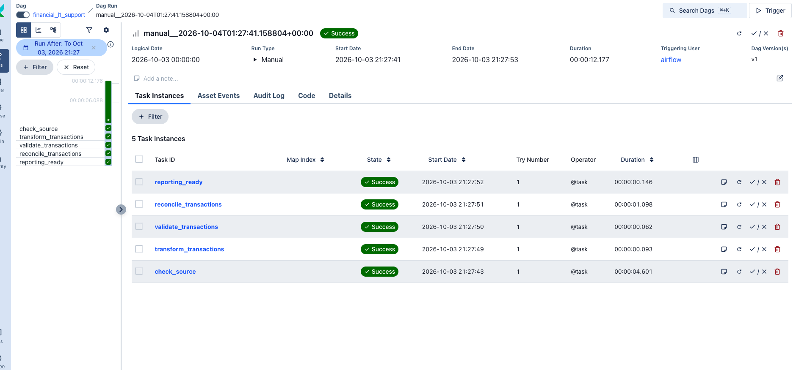
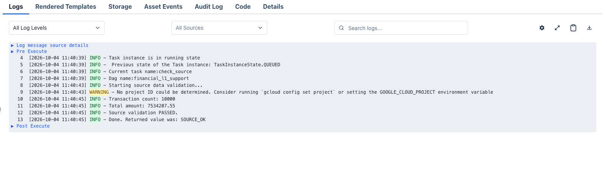
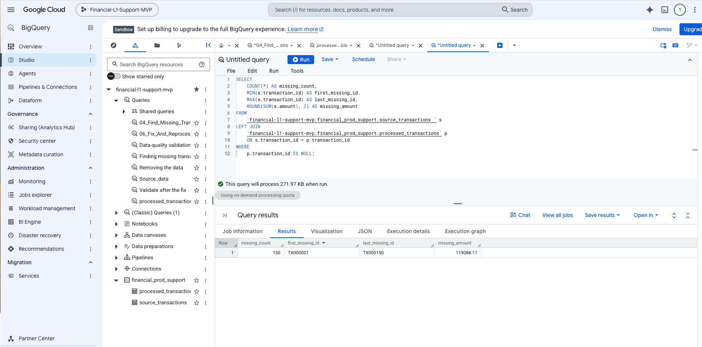
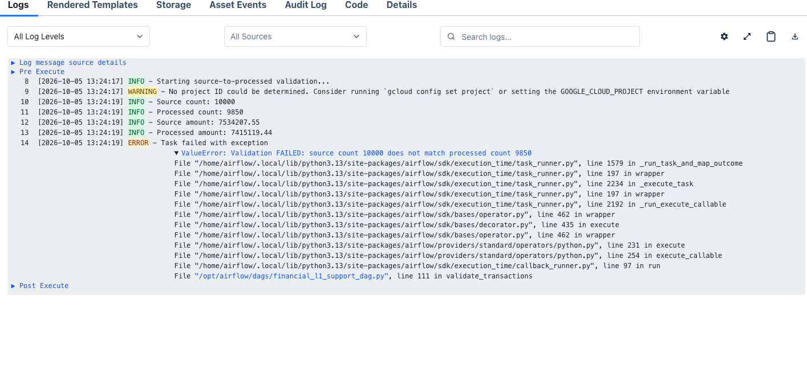
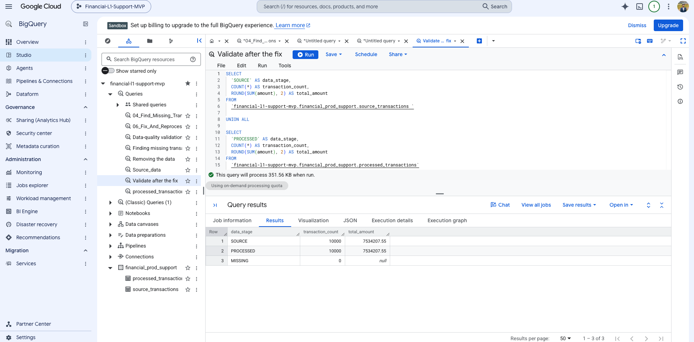

# Financial Systems L1 Production Support

## Project Overview

This is a personal project I created to demonstrate my understanding of financial systems production support, data validation, reconciliation, incident investigation, and post-resolution verification.

The project uses sample financial transaction data and simulates an end-to-end financial data processing workflow.

## Architecture

Sample Financial Transactions  
↓  
BigQuery Source  
↓  
Apache Airflow  
↓  
Source Check  
↓  
Transformation  
↓  
Validation  
↓  
Reconciliation  
↓  
Reporting Ready

## Technologies Used

- Google BigQuery
- SQL
- Apache Airflow
- Python
- Docker

BigQuery was new to me from a hands-on perspective. I independently learned the platform and applied it in this project for data loading, SQL analysis, transformation, validation, and reconciliation.

## Production Support Scenario

The source dataset contained:

- 10,000 transactions
- Total amount: $7,534,207.55

I introduced a controlled data issue to simulate a production incident.

The Airflow workflow detected a validation mismatch:

| Control | Source | Processed |
|---|---:|---:|
| Transaction Count | 10,000 | 9,850 |
| Financial Amount | $7,534,207.55 | $7,415,119.44 |

The validation failure prevented the downstream reconciliation and reporting steps from proceeding.

## L1 Investigation

I used SQL to compare the source and processed datasets.

The investigation identified:

- 150 missing transactions
- Transaction range: TX000001 – TX000150
- Financial variance: $119,088.11

The root cause was an incorrect transformation filter that excluded the affected transactions.

## Resolution and Reconciliation

After correcting the issue, I reprocessed the workflow and performed post-fix validation.

Final results:

- Source transactions: 10,000
- Processed transactions: 10,000
- Source amount: $7,534,207.55
- Processed amount: $7,534,207.55
- Missing transactions: 0
- Duplicate transaction IDs: 0
- Required NULL values: 0
- Invalid amount categories: 0
- Final status: Reporting Ready

## L1 Support Approach

Monitor → Detect → Triage → Investigate → Assess Financial Impact → Identify Root Cause → Support Resolution → Reprocess → Validate → Reconcile → Close

## Disclaimer

This is an independently created personal project using generated sample data for learning and demonstration purposes.

It does not represent American Express systems, architecture, processes, customer information, or proprietary data.

## Project Demonstration

The screenshots below show the production-support scenario I created for this personal project. The purpose was to practice the complete support process: monitoring a workflow, validating financial data, detecting an issue, investigating the impact with SQL, and verifying the data after resolution.

### 1. Successful Airflow Workflow

The workflow contains five stages: source check, transformation, validation, reconciliation, and reporting readiness. This successful Airflow run shows all five tasks completing successfully.

### 2. Source Data Validation

Before processing the data, I created a source-control check to confirm that transaction data was available and to capture the expected control totals.

The source contained 10,000 transactions with a total amount of $7,534,207.55

### 3. Controlled Production-Support Incident

To practice incident investigation, I intentionally created a data mismatch in the personal project. The validation control detected that the source contained 10,000 transactions, while the processed table contained only 9,850 transactions

This demonstrated an important production-support concept: a processing step can complete technically while the resulting financial data can still be incorrect.

### 4. SQL Investigation and Impact Analysis

I used BigQuery SQL to compare the source and processed datasets and isolate the difference.

The investigation identified:

- 150 missing transactions
- Affected transaction range: TX000001 through TX000150
- Financial impact: $119,088.11

### 5. Resolution and Post-Fix Verification

After identifying the cause of the mismatch, the transformation logic was corrected and the data was reprocessed.

**Post-fix validation confirmed:**

- Source transactions: 10,000
- Processed transactions: 10,000
- Source amount: $7,534,207.55
- Processed amount: $7,534,207.55
- Missing transactions: 0

This final verification demonstrates the L1 production-support approach used throughout the project: **monitor → detect → investigate → assess impact → resolve/reprocess → validate → reconcile**.

## Project Takeaway

This is a personal learning project using sample financial transaction data. I built it to strengthen my understanding of BigQuery, Apache Airflow, SQL-based investigation, financial data validation, reconciliation, and production-support workflows.

My goal was not simply to make the workflow run successfully. I wanted to understand how to recognize a data-quality incident, investigate the issue, measure its financial impact, and confirm that the data is accurate before it is considered ready for downstream reporting.
